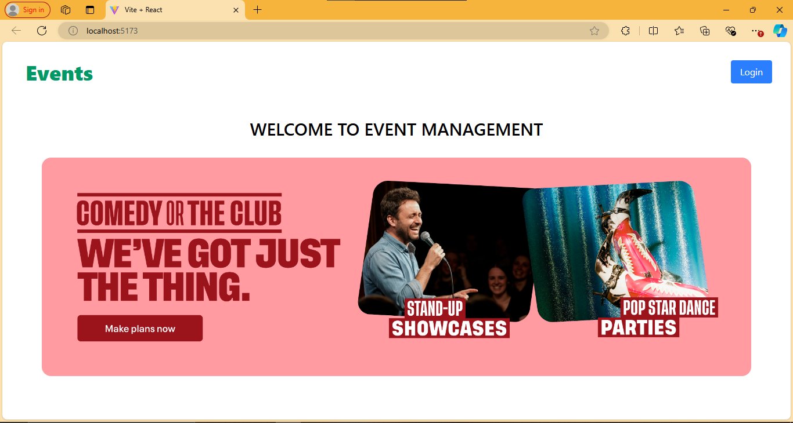
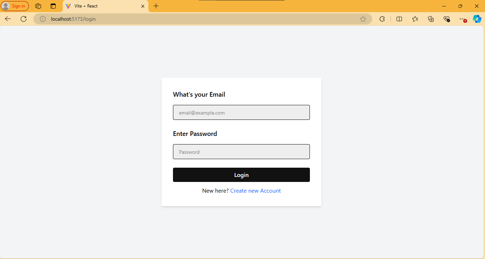
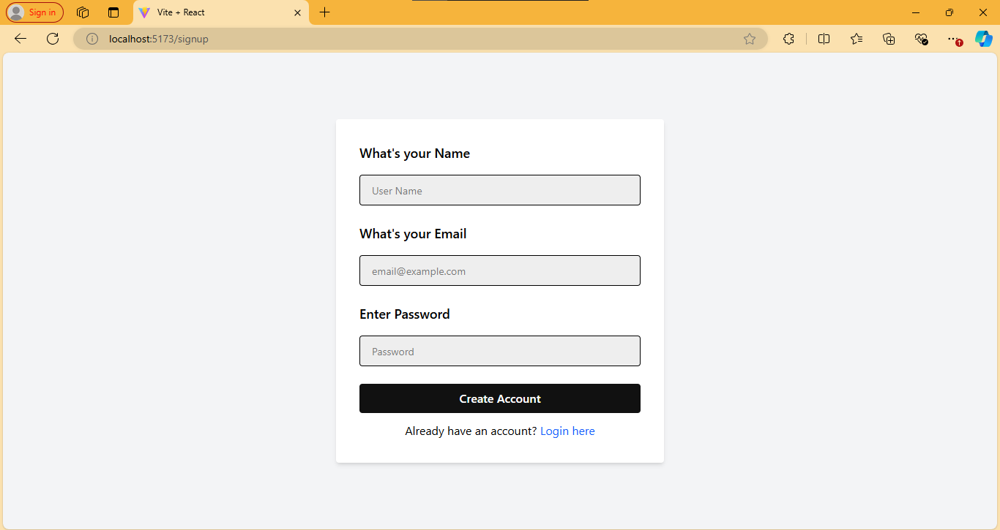
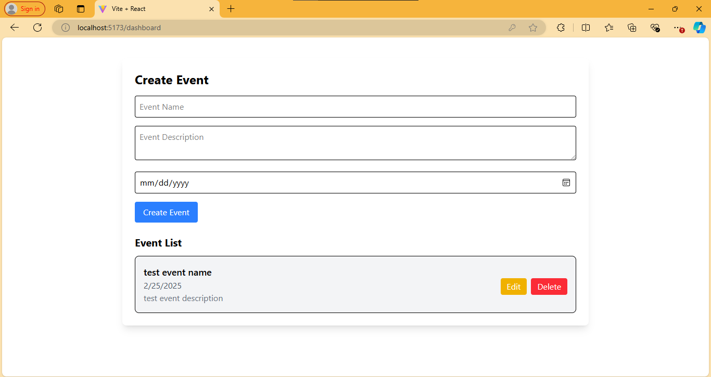

# Event Management System

## Overview

The **Event Management System** is a full-stack application that allows users to create, manage, view, and update events. The system includes user authentication, real-time updates, and a responsive UI.

## Technologies Used

### **Frontend**

- React.js (Vite)
- Material-UI (MUI)
- Axios (API calls)
- WebSockets (Real-time updates)

### **Backend**

- Node.js with Express.js
- MongoDB with Mongoose
- JWT Authentication
- WebSockets (Socket.IO for real-time updates)

### **Deployment**

- **Frontend:** Vercel / Netlify
- **Backend:** Render / Railway.app
- **Database:** MongoDB Atlas

---

## Installation & Setup

### **Prerequisites**

- Node.js installed
- MongoDB (Local or MongoDB Atlas)
- npm or yarn package manager

### **Cloning the Repository**

```sh
  git clone <repository-url>
  cd EventManagement
```

## **Backend Setup**

1. Navigate to the backend directory:
   ```sh
   cd backend
   ```
2. Install dependencies:
   ```sh
   npm install
   ```
3. Create a `.env` file and add the following variables:
   ```env
   MONGODB_URI=your_mongodb_uri
   JWT_SECRET=your_jwt_secret
   PORT=5000
   ```
4. Start the backend server:
   ```sh
   npm start
   ```
5. The backend will be running at `http://localhost:5000`

## **Frontend Setup**

1. Navigate to the frontend directory:
   ```sh
   cd frontend
   ```
2. Install dependencies:
   ```sh
   npm install
   ```
3. Create a `.env` file and set the backend API URL:
   ```env
   VITE_API_BASE_URL=http://localhost:5000
   ```
4. Start the frontend development server:
   ```sh
   npm run dev
   ```
5. The frontend will be running at `http://localhost:5173`

---

## **API Endpoints**

### **Authentication**

- `POST /api/users/register` - Register a new user
- `POST /api/users/login` - Login a user

### **Events**

- `GET /api/events` - Fetch all events
- `POST /api/events` - Create a new event
- `GET /api/events/:id` - Fetch a specific event
- `PUT /api/events/:id` - Update an event
- `DELETE /api/events/:id` - Delete an event

### **Users**

- `GET /api/users` - Fetch all users
- `GET /api/users/:id` - Fetch a single user

### **Registrations**

- `POST /api/registrations` - Register for an event
- `GET /api/registrations` - Fetch all registrations
- `GET /api/registrations/:id` - Fetch a single registration

---

## **Deployment Steps**

### **Backend Deployment (Render/Railway.app)**

1. Push your code to GitHub.
2. Sign up on **Render** or **Railway.app** and connect your repository.
3. Set up environment variables (same as `.env`).
4. Deploy the backend and copy the live API URL.

### **Frontend Deployment (Vercel/Netlify)**

1. Push your frontend code to GitHub.
2. Sign up on **Vercel** or **Netlify** and import your repository.
3. Set the environment variable `VITE_API_BASE_URL` to the live backend API URL.
4. Deploy the frontend and get the live URL.

---

## **Features**

✅ User authentication (Register, Login, JWT Authentication)  
✅ Event creation, editing, and deletion (CRUD operations)  
✅ Real-time event attendee updates (WebSockets)  
✅ Responsive UI using Material-UI  
✅ MongoDB for efficient data storage  
✅ Secure API with JWT Authentication  
✅ Fully deployed on free-tier hosting

---

## **Test User Credentials**

```sh
Email: test@example.com
Password: password123
```

---

## **Contributing**

Contributions are welcome! Feel free to fork this repository, create a branch, and submit a pull request.

---

## **License**

This project is licensed under the MIT License.

## **Screenshots**

### **Home Page**



### **Event Details**



### **User Registration**



### **Event Creation**



---
